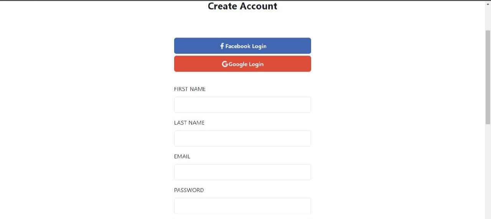
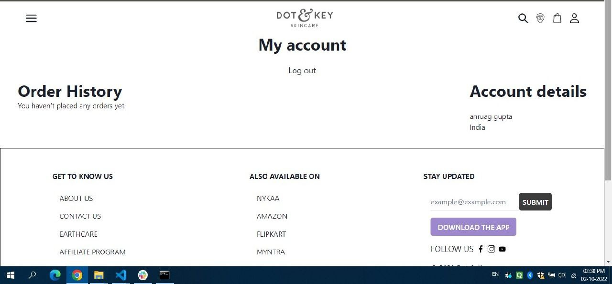
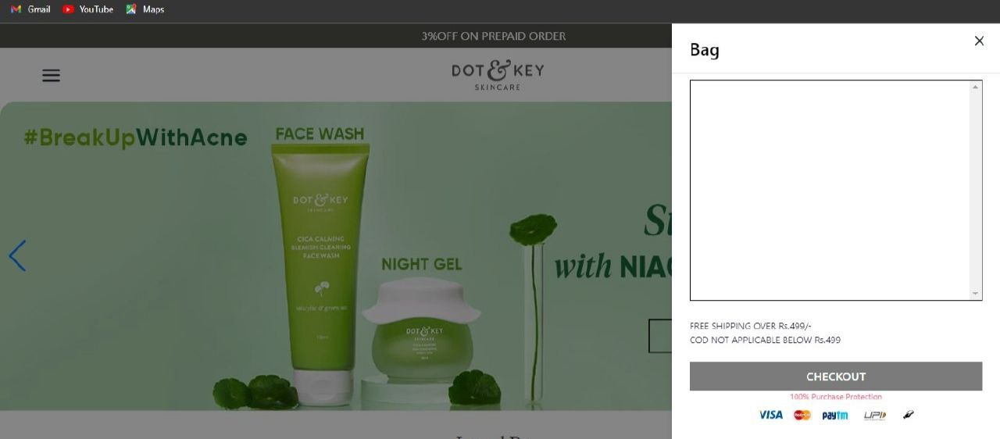
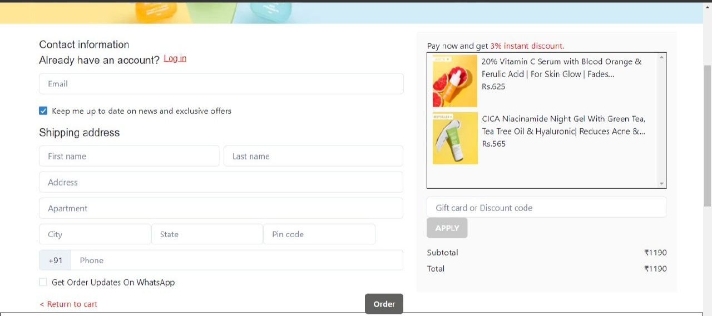

### Hi 👋 

#DotAndKey-Clone

We want to change how we look after ourselves by drawing attention to the areas and the problems that we often overlook, or consider unimportant - but do in fact, affect how we feel and consequently how we appear. By addressing the root of these issues, we bring to you the key to a longer-lasting, deeper and more meaningful version of beautiful.
 
I worked on this project during unit-4 construct week at Masai School.

## Using Languages & Tools 🧰

 <ima width="26px" src="https://cms-assets.tutsplus.com/uploads/users/30/posts/31355/preview_image/pre.png" alt="slick"
 />

## Important Links 🔗
<a href="https://busy-channel-5933-kfc.netlify.app/">Deployed Netlify Link</a>
 
<a href="https://github.com/anuragg0107/green-letter-404.git">Github Link</a>
 
<a href="https://drive.google.com/file/d/1-MC99ch5urcRBOrxV5c5sK_vja8_h9t5/view?usp=sharing">Project presentation</a>

## Screenshots

Home page of the website.

Login and Signup page where user can login or signup in website. 

Here you can seen you details and also you can logout.

In this page you can see all kinds of products are available.

In bag page you can see which quantity added.

Checkout page with total amount of all the cart product and transaction.

## Features
- Responsive Home Page.
- Login/Signup page with working properly.
- Menu page show appending data.
- Add product in cart page successfully.
- Checkout page and order done successfully. 

## Area of Responsibility

- Integrated all the pages successfully.
- Developed the Payment page,Cart Page , Login/Signup Page.
